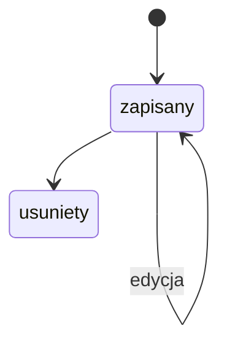
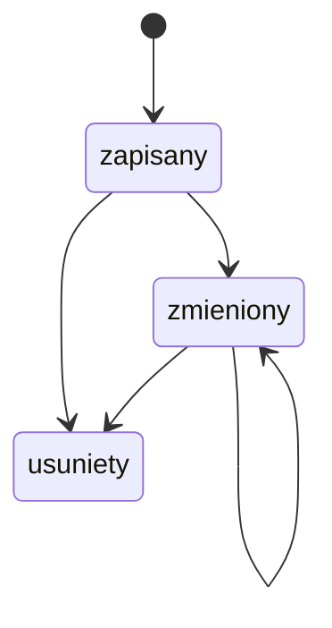
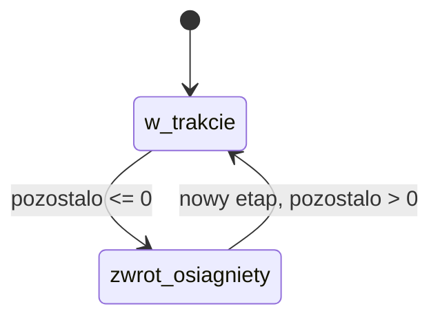
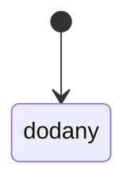
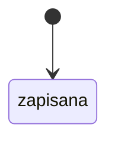
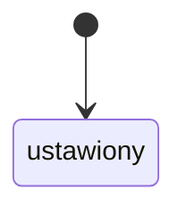

# Encje i stany

Dla kazdej encji: pola kluczowe, stany, przejscia (kto moze), diagram Mermaid.
`Zakwestionowane:` wypelniasz tylko wtedy, gdy zrodlo wyzsze w hierarchii podmylo
strukture encji - wpisz stany/przejscia i numer pytania. Puste = brak zastrzezen.

## Odczyt miesiąca
Pola: okres (RRRR.MM), produkcja, oddane, pobrane, cena kWh, faktura; dane EV per pojazd (kWh domowe, km, stan licznika, ładowanie publiczne)
Stany: zapisany (z danymi EV), usunięty
Przejscia: [*] -> zapisany (Właściciel instalacji, po walidacji); zapisany -> zapisany (edycja, Właściciel instalacji); zapisany -> usunięty (Właściciel instalacji)
Zrodlo: [App] kod-v3.2.4-2026-09-27.md, Walidacja odczytów, main.py /odczyty/nowy; [Dok] README.md, /odczyty/{id}/usun
Zakwestionowane:

## Etap inwestycji
Pola: data, opis, koszt brutto (zł), moc kWp (opcjonalna), notatki
Stany: zapisany, zmieniony, usunięty
Przejscia: [*] -> zapisany (Właściciel instalacji); zapisany -> zmieniony (Właściciel instalacji); zapisany/zmieniony -> usunięty (Właściciel instalacji)
Zrodlo: [Dok] README.md, investments, /inwestycje/nowa; [App] src/main.py update_investment, delete_investment
Zakwestionowane:

## Zwrot inwestycji
Pola: suma etapów inwestycji, suma oszczędności FV, suma oszczędności EV z FV, pozostało
Stany: w trakcie, zwrot osiągnięty (liczone przy każdym wyświetleniu, nie zapisywane)
Przejscia: w trakcie -> zwrot osiągnięty (gdy pozostało ≤ 0, automatycznie); zwrot osiągnięty -> w trakcie (gdy po nowym etapie inwestycji pozostało > 0)
Zrodlo: [App] src/services/calculations.py calc_roi, roi_achieved; [Dok] README.md, calc_roi
Zakwestionowane:

## Pojazd
Pola: nazwa, zużycie kWh/100 km, spalanie odpowiednika l/100 km, rodzaj paliwa, przebieg startowy (wymagany)
Stany: dodany
Przejscia: [*] -> dodany (Właściciel instalacji, tylko z przebiegiem startowym)
Zrodlo: [App] src/main.py create_vehicle (/ev/pojazdy/nowy)
Zakwestionowane:

## Cena paliwa
Pola: data, cena, typ paliwa, źródło
Stany: zapisana
Przejscia: [*] -> zapisana (Właściciel instalacji, wpis ręczny, D-006)
Zrodlo: [App] kod-v3.2.4-2026-09-27.md, Ceny paliwa; [Biz] D-006
Zakwestionowane:

## Okres rozliczeniowy
Pola: data startu, model rozliczeń (net-metering / net-billing)
Stany: ustawiony
Przejscia: [*] -> ustawiony (Właściciel instalacji, D-004)
Zrodlo: [App] kod-v3.2.4-2026-09-27.md, Net-billing i RCE; [Biz] D-004
Zakwestionowane:

