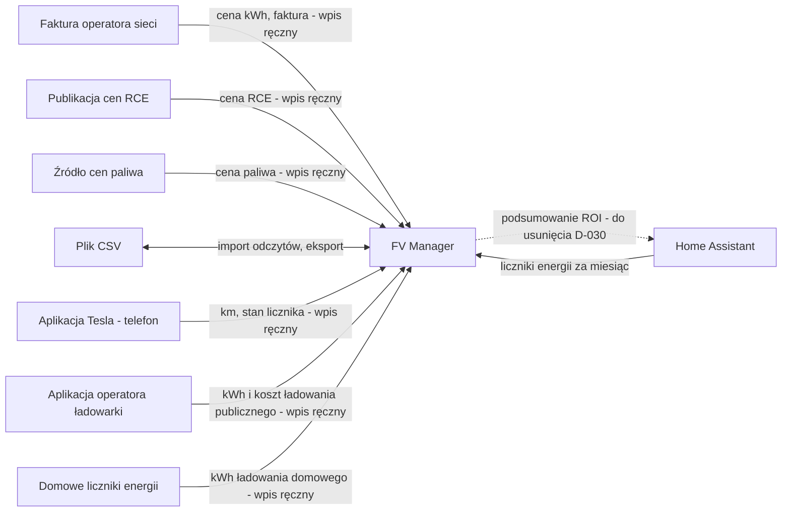

# Systemy

Rejestr systemow, z ktorymi aplikacja wymienia dane, i mapa systemow. Opisuje CO (dane, kierunek, co przy awarii),
nie JAK (protokoly, endpointy - to faza budowy).
Rola: nasz (budowana aplikacja, dokladnie jeden) | zewnetrzny | reczny (Excel, mail - jesli niesie dane spoza aplikacji)
Status: robocze | zakwestionowane (Q-xxx) | zatwierdzone
Rodzaj modulu: `kind: monolith` (SDD.yaml) - aplikacja wdrazana w calosci (HA add-on albo standalone).

- `Wlasciciel` - rola biznesowa odpowiedzialna za integracje (kogo pytac), nie osoba.
- `Master dla` - encje albo pola z ENTITIES/GLOSSARY, dla ktorych ten system jest zrodlem prawdy. Jeden master na dane.
- `Wymiana` - kierunek (`-> my`, `my ->`, `<->`) i czestotliwosc jezykiem biznesu.
- `Przy awarii` - co widzi uzytkownik i co robi aplikacja, gdy system nie odpowiada (przy recznym: gdy wpisu brak).
- `Krytyczna` - `tak`, gdy bez integracji proces biznesowy staje; wtedy obowiazkowa sekcja "Proces systemowy".
- `Wymagania` - `R` rodzaju kontrakt dla `zewnetrzny` i wymiany plikow (kontrola 20 walidacji: przy monolicie WARN, gdy brak);
  `reczny` z wpisem recznym - zwykle `R` formularza, bez kontraktu.

| ID | System | Rola | Wlasciciel | Master dla | Wymiana | Przy awarii | Krytyczna | Wymagania | Status | Zrodlo |
|----|--------|------|------------|------------|---------|-------------|-----------|-----------|--------|--------|
| S-001 | FV Manager | nasz | właściciel instalacji | Odczyt miesiąca, Etap inwestycji, Pojazd, Okres rozliczeniowy, Śledzenie cen paliwa | - | - | - | - | robocze | [Biz] session-2026-10-04.md; [App] kod-v3.2.4-2026-09-27.md |
| S-002 | Home Assistant | zewnetrzny | właściciel instalacji | liczniki energii w HA: produkcja PV, pobór z sieci (1.8.0), oddanie do sieci (2.8.0) - wartosci miesiaca w Odczycie miesiąca zapisuje FV Manager | <-> liczniki -> my na żądanie przy wpisie odczytu (wybrany miesiąc); podsumowanie ROI my -> HA, gdy HA pyta - do usunięcia (D-030) | brak danych z HA - komunikat „Brak danych dla <encja> za RRRR-MM”, odczyt nie jest blokowany, właściciel przepisuje liczby ręcznie z aplikacji do zarządzania fotowoltaiką, która bierze dane z urządzenia (A-015 potwierdzone, [Biz] session-2026-10-08.md, session-2026-10-07.md Q-054; nazwa aplikacji - Q-054 zaparkowane) | nie (odczyt można wpisać ręcznie, R-001) | R-020 | robocze | [Biz] session-2026-10-04.md, Q-030 (A-010); [Dok] README.md, Home Assistant; [App] src/main.py:2155-2190 |
| S-003 | Faktura operatora sieci | reczny | właściciel instalacji | cena kWh, numer i kwota brutto faktury w Odczycie miesiąca | -> my, wpis ręczny raz w miesiącu przy odczycie | brak ceny kWh w odczycie - oszczędność liczona po cenie domyślnej ustawionej przez właściciela w konfiguracji add-onu (D-031) | nie | R-001 | robocze | [App] src/main.py:26, 734; [Dok] README.md |
| S-004 | Publikacja cen RCE | reczny | właściciel instalacji | Cena RCE | -> my, wpis ręczny (data, cena, źródło); częstotliwość ? (Q-051) | ? (Q-051 - brak ceny RCE dla miesiąca w net-billingu) | nie | R-017 | robocze | [Biz] board.json, qq002 (D-004) |
| S-005 | Źródło cen paliwa | reczny | właściciel instalacji | Cena paliwa | -> my, wpis ręczny (data, cena, typ, źródło), gdy cena się zmienia | miesiące przed pierwszą ceną - wg pierwszej ceny (D-029); między wpisami obowiązuje ostatnia (D-023) | nie | R-011 | robocze | [Biz] board.json, qq005 (D-006); [Biz] D-023, D-029 |
| S-006 | Plik CSV | reczny | właściciel instalacji | - (nośnik; po imporcie masterem jest FV Manager) | <-> import odczytów (R-004), eksport i kopia danych (R-013), na żądanie | import: cały plik albo nic (BR-002) | nie | R-004, R-013 | robocze | [App] kod-v3.2.4-2026-09-27.md; [Biz] session-2026-10-04.md (R-004, R-013) |
| S-007 | Aplikacja Tesla (telefon) | reczny | właściciel instalacji | przejechane km i stan licznika pojazdu w Odczycie miesiąca | -> my, wpis ręczny przy odczycie miesiąca | ? (brak danych km w aplikacji - nie wystąpiło; Q-056 dotyczyło kWh) | nie | R-010, R-001 | robocze | [Biz] session-2026-10-07.md, Q-052; [Biz] session-2026-10-08.md, Q-056 |
| S-008 | Aplikacja operatora ładowarki publicznej | reczny | właściciel instalacji | kWh i koszt ładowania publicznego w Odczycie miesiąca | -> my, wpis ręczny przy odczycie miesiąca | brak danych przy wpisie - pola ładowania publicznego zostają puste, właściciel uzupełnia je później edycją odczytu (R-012) | nie | R-010, R-001 | robocze | [Biz] session-2026-10-07.md, Q-053; [Biz] session-2026-10-08.md, Q-057 |
| S-009 | Domowe liczniki energii (ładowanie auta) | reczny | właściciel instalacji | kWh ładowania domowego w Odczycie miesiąca | -> my, wpis ręczny przy odczycie miesiąca | odczyt dotąd zawsze możliwy; gdy się nie da - właściciel wpisuje szacunek kWh (Q-059) | nie | R-010, R-001 | robocze | [Biz] session-2026-10-08.md, Q-056, Q-059 |

Poza rejestrem: Tesla Fleet API - integracja wycofana (R-018), nie jest systemem tej aplikacji. Aplikacja Tesla w telefonie (S-007) to ręczne źródło przejechanych km, nie integracja.

## Mapa systemow
GENEROWANE z tabeli - nie edytuj (odtwarza /sdd:domain).

